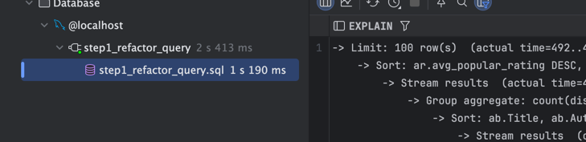
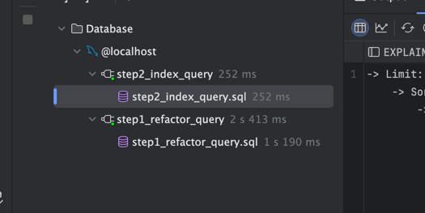

EXPLAIN ANALYZE
SELECT
ab.Title,
ab.Author,
ab.`Main Genre`,
ab.`Sub Genre`,
gr.genre AS goodreads_genre,
COUNT(DISTINCT gr.reviews) AS review_count,
(
SELECT AVG(CAST(pb.Rating AS DECIMAL(3,2)))
FROM Amazon_popular_books_dataset pb
WHERE LOWER(pb.Title) = LOWER(ab.Title)
) AS avg_popular_rating
FROM Amazon_books_dataset ab
LEFT JOIN GoodReads_100k_books gr
ON LOWER(gr.title) = LOWER(ab.Title)
WHERE
LENGTH(ab.Title) > 3
AND CAST(ab.Rating AS DECIMAL(3,2)) > 3.5
AND ab.Price NOT IN ('Free', 'N/A')
GROUP BY
ab.Title, ab.Author, ab.`Main Genre`, ab.`Sub Genre`, gr.genre
ORDER BY avg_popular_rating DESC
LIMIT 100;

->

Explain analize for the default non optimized query!

22:16 min

-> Limit: 100 row(s)  (actual time=36875..36876 rows=100 loops=1)
-> Sort: avg_popular_rating DESC, limit input to 100 row(s) per chunk  (actual time=36875..36876 rows=100 loops=1)
-> Stream results  (actual time=36850..36873 rows=7360 loops=1)
-> Group aggregate: count(distinct goodreads_100k_books.reviews)  (actual time=36850..36868 rows=7360 loops=1)
-> Sort: ab.Title, ab.Author, ab.`Main Genre`, ab.`Sub Genre`, gr.genre  (actual time=36850..36854 rows=7478 loops=1)
-> Stream results  (cost=54.9e+6 rows=548e+6) (actual time=189..36823 rows=7478 loops=1)
-> Left hash join (<hash>(lower(gr.title))=<hash>(lower(ab.Title))), extra conditions: (lower(gr.title) = lower(ab.Title))  (cost=54.9e+6 rows=548e+6) (actual time=185..396 rows=7478 loops=1)
-> Filter: ((length(ab.Title) > 3) and (cast(ab.Rating as decimal(3,2)) > 3.5) and (ab.Price not in ('Free','N/A')))  (cost=810 rows=6031) (actual time=0.0324..6.08 rows=7439 loops=1)
-> Table scan on ab  (cost=810 rows=7539) (actual time=0.0281..4.26 rows=7928 loops=1)
-> Hash
-> Table scan on gr  (cost=20 rows=90892) (actual time=0.0147..97.1 rows=100000 loops=1)

This is non optimized query because of using small subqueries ' as () ' while not using CTE; 
Using 'LOWER' in 'JOIN' and 'WHERE' blocks using indexes!
'CAST' in 'WHERE' makes it more harder to calculate and avoids using indexes;
'DISTINCT' in 'COUNT' is bad practice due to disitnct complexity when we need only to count lines;
Using 'LIMIT' without indexes forces sql to do query for all lines and ony then limit it by LIMIT;

--------------

EXPLAIN ANALYZE
WITH avg_ratings AS (
SELECT
LOWER(Title) AS lower_title,
AVG(CAST(Rating AS DECIMAL(3,2))) AS avg_popular_rating
FROM Amazon_popular_books_dataset
GROUP BY LOWER(Title)
)

SELECT
ab.Title,
ab.Author,
ab.`Main Genre`,
ab.`Sub Genre`,
gr.genre AS goodreads_genre,
COUNT(DISTINCT gr.reviews) AS review_count,
ar.avg_popular_rating
FROM Amazon_books_dataset ab
LEFT JOIN GoodReads_100k_books gr
ON LOWER(gr.title) = LOWER(ab.Title)
LEFT JOIN avg_ratings ar
ON ar.lower_title = LOWER(ab.Title)
WHERE
LENGTH(ab.Title) > 3
AND CAST(ab.Rating AS DECIMAL(3,2)) > 3.5
AND ab.Price NOT IN ('Free', 'N/A')
GROUP BY
ab.Title, ab.Author, ab.`Main Genre`, ab.`Sub Genre`, gr.genre, ar.avg_popular_rating
ORDER BY ar.avg_popular_rating DESC
LIMIT 100;

-->

Explain analyze for the new first step optimized query
2 sec

-> Limit: 100 row(s)  (actual time=492..492 rows=100 loops=1)
-> Sort: ar.avg_popular_rating DESC, limit input to 100 row(s) per chunk  (actual time=492..492 rows=100 loops=1)
-> Stream results  (actual time=470..489 rows=7360 loops=1)
-> Group aggregate: count(distinct goodreads_100k_books.reviews)  (actual time=470..485 rows=7360 loops=1)
-> Sort: ab.Title, ab.Author, ab.`Main Genre`, ab.`Sub Genre`, gr.genre, ar.avg_popular_rating  (actual time=470..473 rows=7478 loops=1)
-> Stream results  (cost=269e+6 rows=0) (actual time=303..459 rows=7478 loops=1)
-> Left hash join (<hash>(ar.lower_title)=<hash>(lower(ab.Title))), extra conditions: (ar.lower_title = lower(ab.Title))  (cost=269e+6 rows=0) (actual time=303..455 rows=7478 loops=1)
-> Left hash join (<hash>(lower(gr.title))=<hash>(lower(ab.Title))), extra conditions: (lower(gr.title) = lower(ab.Title))  (cost=54.9e+6 rows=548e+6) (actual time=272..421 rows=7478 loops=1)
-> Filter: ((length(ab.Title) > 3) and (cast(ab.Rating as decimal(3,2)) > 3.5) and (ab.Price not in ('Free','N/A')))  (cost=810 rows=6031) (actual time=3.33..10.2 rows=7439 loops=1)
-> Table scan on ab  (cost=810 rows=7539) (actual time=3.14..8.18 rows=7928 loops=1)
-> Hash
-> Table scan on gr  (cost=20 rows=90892) (actual time=0.0555..180 rows=100000 loops=1)
-> Hash
-> Table scan on ar  (cost=2.5..2.5 rows=0) (actual time=11.6..12.1 rows=4757 loops=1)
-> Materialize CTE avg_ratings  (cost=0..0 rows=0) (actual time=11.6..11.6 rows=4757 loops=1)
-> Table scan on <temporary>  (actual time=8.85..9.42 rows=4757 loops=1)
-> Aggregate using temporary table  (actual time=8.85..8.85 rows=4757 loops=1)
-> Table scan on Amazon_popular_books_dataset  (cost=518 rows=4935) (actual time=0.0315..2.42 rows=4846 loops=1)

This first step optimized query is  (22*60+16) / 2 = _**668** times better!!_  

The main reason of this transformation, is replacing subquery that was being done for each step(each line) -> 
with CTE (WITH .. as () ) that executed only one time and then we only were using this result temporary table.

----------

ALTER TABLE GoodReads_100k_books
ADD COLUMN lower_title VARCHAR(512) GENERATED ALWAYS AS (LOWER(title)) STORED;

CREATE INDEX idx_gr_lower_title ON GoodReads_100k_books (lower_title);

ALTER TABLE Amazon_books_dataset
ADD COLUMN lower_title VARCHAR(512) GENERATED ALWAYS AS (LOWER(Title)) STORED;

CREATE INDEX idx_ab_lower_title ON Amazon_books_dataset (lower_title);

ALTER TABLE Amazon_popular_books_dataset
ADD COLUMN lower_title VARCHAR(512) GENERATED ALWAYS AS (LOWER(Title)) STORED;

CREATE INDEX idx_ap_lower_title ON Amazon_popular_books_dataset (lower_title);

EXPLAIN ANALYZE
WITH avg_ratings AS (
SELECT
lower_title,
AVG(CAST(Rating AS DECIMAL(3,2))) AS avg_popular_rating
FROM Amazon_popular_books_dataset
GROUP BY lower_title
)

SELECT
ab.Title,
ab.Author,
ab.`Main Genre`,
ab.`Sub Genre`,
gr.genre AS goodreads_genre,
COUNT(DISTINCT gr.reviews) AS review_count,
ar.avg_popular_rating
FROM Amazon_books_dataset ab
LEFT JOIN GoodReads_100k_books gr
ON gr.lower_title = ab.lower_title
LEFT JOIN avg_ratings ar
ON ar.lower_title = ab.lower_title
WHERE
LENGTH(ab.Title) > 3
AND CAST(ab.Rating AS DECIMAL(3,2)) > 3.5
AND ab.Price NOT IN ('Free', 'N/A')
GROUP BY
ab.Title, ab.Author, ab.`Main Genre`, ab.`Sub Genre`, gr.genre, ar.avg_popular_rating
ORDER BY ar.avg_popular_rating DESC
LIMIT 100;

->

Explain analyze for the new second step optimized query with indexes
252ms

-> Limit: 100 row(s)  (actual time=114..115 rows=100 loops=1)
-> Sort: ar.avg_popular_rating DESC, limit input to 100 row(s) per chunk  (actual time=114..115 rows=100 loops=1)
-> Stream results  (actual time=92.8..112 rows=7360 loops=1)
-> Group aggregate: count(distinct goodreads_100k_books.reviews)  (actual time=92.8..107 rows=7360 loops=1)
-> Sort: ab.Title, ab.Author, ab.`Main Genre`, ab.`Sub Genre`, gr.genre, ar.avg_popular_rating  (actual time=92.8..95.9 rows=7478 loops=1)
-> Stream results  (cost=3e+6 rows=29.9e+6) (actual time=25.8..76.7 rows=7478 loops=1)
-> Left hash join (<hash>(ar.lower_title)=<hash>(ab.lower_title)), extra conditions: (ar.lower_title = ab.lower_title)  (cost=3e+6 rows=29.9e+6) (actual time=25.7..72.2 rows=7478 loops=1)
-> Nested loop left join  (cost=7765 rows=6293) (actual time=0.0633..33.1 rows=7478 loops=1)
-> Filter: ((length(ab.Title) > 3) and (cast(ab.Rating as decimal(3,2)) > 3.5) and (ab.Price not in ('Free','N/A')))  (cost=843 rows=6293) (actual time=0.0374..7.25 rows=7439 loops=1)
-> Table scan on ab  (cost=843 rows=7866) (actual time=0.0324..5.24 rows=7928 loops=1)
-> Index lookup on gr using idx_gr_lower_title (lower_title = ab.lower_title)  (cost=1 rows=1) (actual time=0.00332..0.00335 rows=0.0285 loops=7439)
-> Hash
-> Table scan on ar  (cost=2688..2750 rows=4745) (actual time=21.9..22.6 rows=4757 loops=1)
-> Materialize CTE avg_ratings  (cost=2688..2688 rows=4745) (actual time=21.9..21.9 rows=4757 loops=1)
-> Group aggregate: avg(cast(amazon_popular_books_dataset.Rating as decimal(3,2)))  (cost=1595 rows=4745) (actual time=0.0281..17.8 rows=4757 loops=1)
-> Index scan on Amazon_popular_books_dataset using idx_ap_lower_title  (cost=500 rows=4754) (actual time=0.0129..12.9 rows=4846 loops=1)

The new second step optimized query with indexes is better because of not using LOWER in the query but creating new column on the tables with already lower title and for this column
we added indexes (because we could not put indexes on the LOWER(title), we need separately column)

Because of that changes we optimized our query for 2*1000 / 252 = 8 times in compare to the last changes, and
(22*60+16)*1000 / 252  or  668*8  = about _**5320** times better_ !  